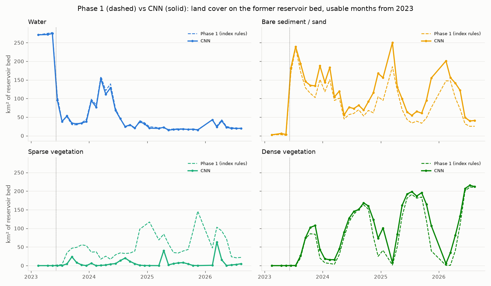
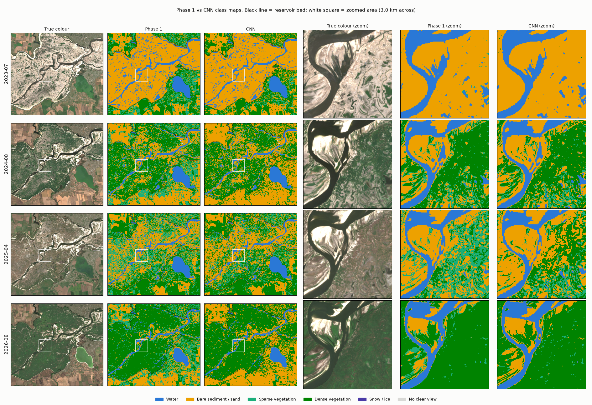

# kakhovka reservoir: land cover after the dam collapse

month by month land cover map of the former kakhovka reservoir bed, from free sentinel-2 imagery. the dam was destroyed on 6 june 2023, the reservoir drained within days, and the old lake bed has been turning green since. before the dam was built in 1956 this area was velykyi luh, a large floodplain of meadows and willow woods ([science](https://www.science.org/content/article/ukrainian-scientists-tally-grave-environmental-consequences-kakhovka-dam-disaster)).

two methods are compared: simple index thresholds (no learning) and a cnn trained on my own hand labels.

live explorer: coming soon

## stack

python, google earth engine, rasterio, pytorch, mlflow, streamlit, pytest, github actions

## what it does

- pulls 48 monthly cloud-free sentinel-2 composites (2019-2026) for a 468 km² test area through earth engine
- takes the pre-collapse reservoir outline from jrc global surface water (278 km² of old lake bed in the test area)
- phase 1: classifies every pixel with index thresholds (mndwi for water, ndvi for vegetation)
- hand labelling: a streamlit app to label points on high-res imagery, 180 training and 300 test points
- phase 2: trains a small cnn on confident phase 1 pixels plus the hand labels, 8 variants tracked in mlflow
- maps both methods for every month and compares them, plus google dynamic world as an outside reference

## classes

water, bare (sand, mud), sparse vegetation, dense vegetation, snow/ice. vegetation is split by how much of the pixel is covered with plants, not by type. i tried labelling willow vs grass vs reeds first, but the young vegetation (1-2 m) can't be told apart from above, and gedi lidar can't measure heights below ~3 m either.

## phase 1: index thresholds

water = mndwi > 0, dense = ndvi >= 0.5, sparse = ndvi 0.3-0.5, bare = the rest, snow only in winter. mndwi instead of ndwi because algae-rich water fools ndwi. the cut-offs were checked against the training labels and barely move when re-tuned in cross-validation.

## phase 2: cnn

- fully convolutional network, 5 layers of 3x3 convolutions, each pixel sees an 11x11 pixel (110 m) neighbourhood
- input: 10 bands, ndvi, mndwi, month of year, and the same layers for the 2 previous months
- labels: ~43k pixels where phase 1 is very sure (clear water, clear sand, clearly dense) plus 179 hand labels, which are the only examples of sparse vegetation
- no weak labels within 300 m of any hand labelled or test point, so the model can't memorise them
- scored with 4-fold cross-validation on the hand labels, phase 1 re-tuned inside each fold the same way

| variant | accuracy | macro f1 |
|---|---|---|
| phase 1 (index thresholds) | 0.80 | 0.78 |
| cnn, base (23 px view) | 0.79 | 0.74 |
| cnn, no hand labels | 0.74 | 0.61 |
| cnn, 11 px view | 0.79 | 0.76 |
| cnn, 11 px view + 2 previous months (final) | 0.80 | 0.78 |

full table with all 8 runs: `outputs/tables/experiments_velykyi_luh.md`.

the cnn matches the thresholds but doesn't beat them (bootstrap 95% interval for the difference in macro f1: -0.07 to +0.06). it is better on water and bare, worse on sparse and dense, and its maps are less noisy. without hand labels it never predicts sparse vegetation at all. a smaller view worked better, sparse cover comes in small patches and a wide view averages them away.

## results

old reservoir bed (278 km²), final cnn, km²:

| | water | bare | sparse | dense |
|---|---|---|---|---|
| may 2023 (before) | 275 | 4 | 0 | 0 |
| aug 2023 | 53 | 194 | 5 | 26 |
| aug 2024 | 25 | 82 | 20 | 151 |
| aug 2025 | 18 | 65 | 8 | 187 |
| aug 2026 | 20 | 41 | 5 | 212 |




- both methods agree on water and dense vegetation, they disagree a lot on sparse vegetation (cnn 0-63 km², thresholds 3-146 km²), so that number is the least reliable one
- estimating areas directly from the hand labels (stratified estimator) for aug 2024 gives dense 134 km² (115-154) and bare 84 km² (71-97), so both maps probably overcount dense a bit
- google dynamic world calls most of the bed "crops" in 2024 and 196 km² "trees" in 2026, a global model struggles with such a new landscape
- bilozerskyi lyman, a separately dammed lake inside the old reservoir outline, is kept out of the stats

## still to do

- label the 300 test points and run `scripts/evaluate.py --set test` for the final, unbiased comparison
- scale up to the whole reservoir (~2 150 km²)

## running locally

```bash
pip install -r requirements.txt
earthengine authenticate
python scripts/pull_reservoir_mask.py           # reservoir outline
python scripts/pull_s2_composite.py --all       # 48 monthly composites, ~1.5 h
python scripts/run_baseline.py                  # phase 1
python scripts/train_cnn.py --dilations 1 1 1 1 1 --context -1 -2 --name fcn_rf11_m1_m2
python scripts/predict_cnn.py                   # cnn maps for every month
python scripts/compare_methods.py               # figures
streamlit run apps/explorer_app.py              # explorer
streamlit run apps/labeling_app.py              # labelling
mlflow ui --backend-store-uri sqlite:///mlflow.db --port 5001
pytest
```

## structure

```
src/
  config.py             test area, grid, months
  data/                 earth engine downloads, reservoir outline, sentinel-2 composites
  baseline/             phase 1 thresholds
  labeling/             point sampling and label storage
  model/                cnn, features, weak and hand labels, metrics
  stats.py              km² per class, region and month
scripts/                everything you run (see above)
apps/
  labeling_app.py       hand labelling
  explorer_app.py       month slider, phase 1 vs cnn maps
labels/                 sampled points and hand labels
explorer_data/          class maps and monthly satellite images for the online explorer
tests/                  46 pytest tests, run by github actions on every push
outputs/                figures, tables, training logs
data/                   rasters and model weights (not in git)
```
